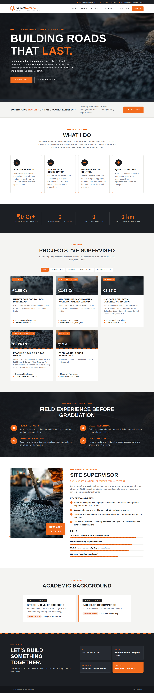

# Vedant Nemade — Portfolio

Personal portfolio website for **Vedant Milind Nemade**, Civil Engineering student and road-construction Site Supervisor (Pooja Construction, Bhusawal).



A static site (HTML, CSS and a little JavaScript) with no build step.

## Run locally
- **Quickest:** open `portfolio.html`. It's a single file with the styles, script, photo and resume built in, so it works on its own (you can email it or copy it anywhere).
- `index.html` is the source version. It only looks right when `style.css`, `script.js` and `assets/` sit next to it (for example after downloading the whole repo as a ZIP). Opened by itself, it shows as plain unstyled text.
- Viewing either file on github.com shows the code, not the page. Use GitHub Pages (below) to see it as a website.

## Publish with GitHub Pages
1. Repo **Settings → Pages**
2. Source: **Deploy from a branch** → pick the branch and `/ (root)` → Save
3. The site goes live at `https://vedantnemade70.github.io/<repo-name>/`

## Structure
```
index.html        page content
style.css         styles (asphalt + safety-orange theme)
script.js         mobile menu, project filters, counters, scroll effects
portfolio.html    generated single-file copy (from build.py)
build.py          builds portfolio.html
assets/           hero photo and downloadable resume
```

## Editing
After changing `index.html`, `style.css`, `script.js` or `assets/`, run `python3 build.py` to regenerate `portfolio.html`.

- Projects: edit the `<article class="project">` blocks in `index.html`. `data-type` controls which filter button shows the project (`asphalt`, `concrete`, `highway`).
- Colors: change `--orange` and `--asphalt` at the top of `style.css`.
- Resume: replace `assets/Vedant_Nemade_Resume.docx`. A PDF works in more browsers, so if you switch to one, update the two download links.
